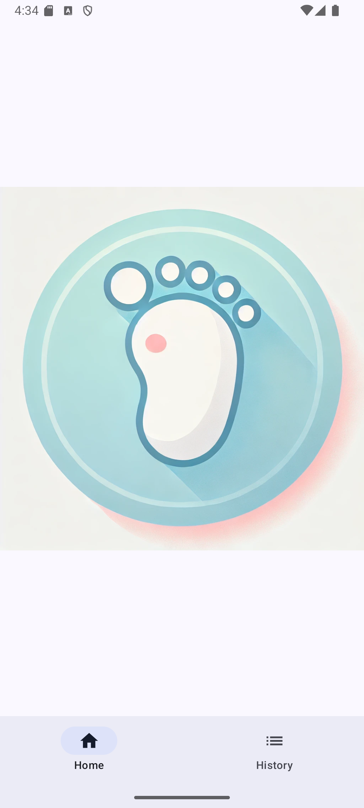
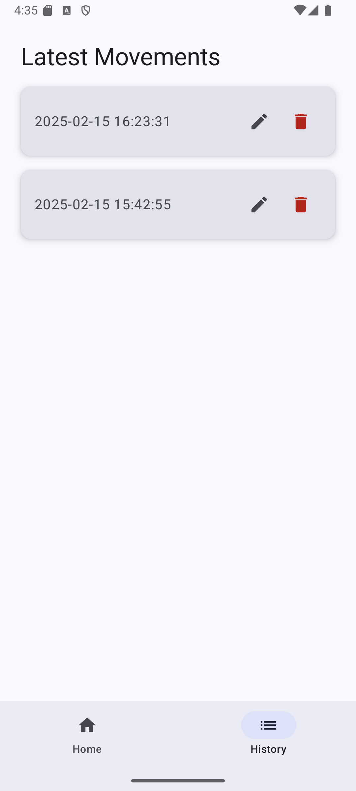

# 👣 BabyKicks - Baby Movement Tracker

**BabyKicks** is a simple and user-friendly **baby movement tracking** Android app built with **Jetpack Compose**. It allows expectant mothers to record and monitor their baby's kicks in the womb, helping them keep track of fetal movements efficiently.

---

## 📱 Features
✔ **Record Baby Movements** by tapping the screen.  
✔ **View Movement History** in a clean and structured list.  
✔ **Edit or Delete** recorded movements easily.  
✔ **Toast Notifications** for user feedback.  
✔ **Jetpack Compose UI** for a modern and smooth experience.  
✔ **Room Database** for persistent data storage.  
✔ **Bottom Navigation** for seamless navigation between screens.  
✔ **Custom Launcher Icon** for a professional look.  

---

## 🚀 Tech Stack
- **Kotlin**
- **Jetpack Compose**
- **Room Database**
- **Navigation Component**
- **Material 3 Design**
- **Coroutines & StateFlow**

---

## 📸 Screenshots
### **1️⃣ Home Screen (Tap to Record a Movement)**


### **2️⃣ Movement History**


---

## 🛠 Installation & Setup

### 1️⃣ Clone the Repository
```sh
git clone git@github.com:hashansilva/baby-kicks.git
cd baby-kicks
```

### 2️⃣ Open in Android Studio
- Open **Android Studio** and select "Open an Existing Project".
- Navigate to the project directory and open it.

### 3️⃣ Sync Gradle & Build Project
- Ensure your Gradle syncs successfully.
- If you face dependency issues, click **"Sync Now"** in Android Studio.

### 4️⃣ Run the App
- Connect an **Android device** or use an **Emulator**.
- Click **Run ▶** or use `Shift + F10` to launch the app.

---

## 🎨 App Architecture
The app follows **MVVM (Model-View-ViewModel)** architecture for better scalability and maintainability.

📂 **Project Structure**
```
📦 com.hashan0314.babykicks  
 ┣ 📂 ui/        # BabyKickViewModel, MainScreen, MovementHistoryScreen & other related ui components
 ┣ 📂 ui.theme/         # App Theme & Styling  
 ┣ 📂 data/         # Room Database & DAO  
 ┣ 📜 MainActivity.kt   # Main Application Entry 
 ┗ 📜 README.md         # Documentation  
```

---

## 🎯 How to Use
1️⃣ **Open the app.**  
2️⃣ **Tap the screen** to record a baby kick.  
3️⃣ **View recorded movements** in the history tab.  
4️⃣ **Edit or delete** any record by tapping the respective icons.

---

## 🔧 Dependencies (build.gradle.kts)
Ensure you have the following dependencies in your `build.gradle.kts`:

```kotlin
dependencies {
    implementation(libs.androidx.core.ktx)
    implementation(libs.androidx.lifecycle.runtime.ktx)
    implementation(libs.androidx.activity.compose)
    implementation(platform(libs.androidx.compose.bom))
    implementation(libs.androidx.ui)
    implementation(libs.androidx.ui.graphics)
    implementation(libs.androidx.ui.tooling.preview)
    implementation(libs.androidx.material3)
    implementation("androidx.room:room-runtime:2.6.1")
    implementation(libs.androidx.navigation.compose)
    ksp("androidx.room:room-compiler:2.6.1")
    implementation("androidx.room:room-ktx:2.6.1")
    testImplementation(libs.junit)
    androidTestImplementation(libs.androidx.junit)
    androidTestImplementation(libs.androidx.espresso.core)
    androidTestImplementation(platform(libs.androidx.compose.bom))
    androidTestImplementation(libs.androidx.ui.test.junit4)
    debugImplementation(libs.androidx.ui.tooling)
    debugImplementation(libs.androidx.ui.test.manifest)
}
```

---

## 🤝 Contributing
Contributions are welcome! 🎉 If you’d like to improve the app:  
1. **Fork** this repository.  
2. **Create a feature branch:** `git checkout -b feature-name`  
3. **Commit your changes:** `git commit -m "Add feature"`  
4. **Push to the branch:** `git push origin feature-name`  
5. **Submit a Pull Request**  

---

## 📝 License
This project is **open-source** under the **MIT License**.

---

## 📩 Contact & Support
For any issues or feature requests, feel free to:  
📧 Email: [hashan.silva@gmail.com]  
🐙 GitHub: [https://github.com/hashansilva/baby-kicks]

---

**👣 Happy Tracking & Stay Connected!** 💙
